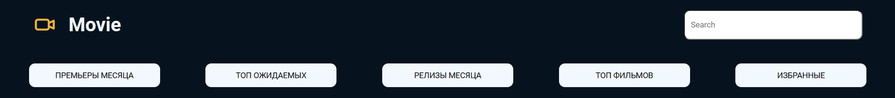
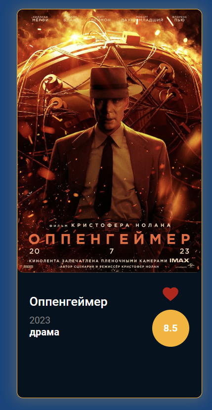
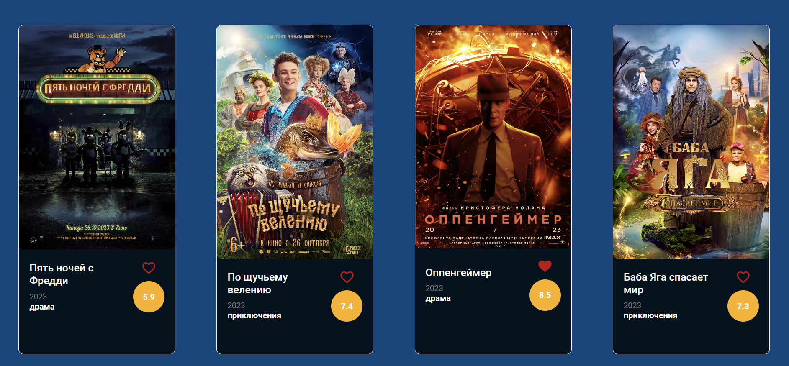

Проект каталог фильмов с фильтрацией по четырем категориям, поиском и возможностью добавить фильм спикос избранное.

Возможностью сохранить понравившийся фильм в категорию избранное

Поле отображение списка :

используемые технологии :
HTML5, CSS3, JavaScript, Public API

Как установить : Скопировать ssh ключ Вставить в командру строку и склонировать проект при помощи команды : git clone Открыть проект в редакторе кода Скопировать локальный путь и вставить в браузер

Как запустить :
Скопируйте путь к HTML файлу и вставте в строку браузера .

Автор(ы): https://www.linkedin.com/in/roman-surkov-a67842277/
